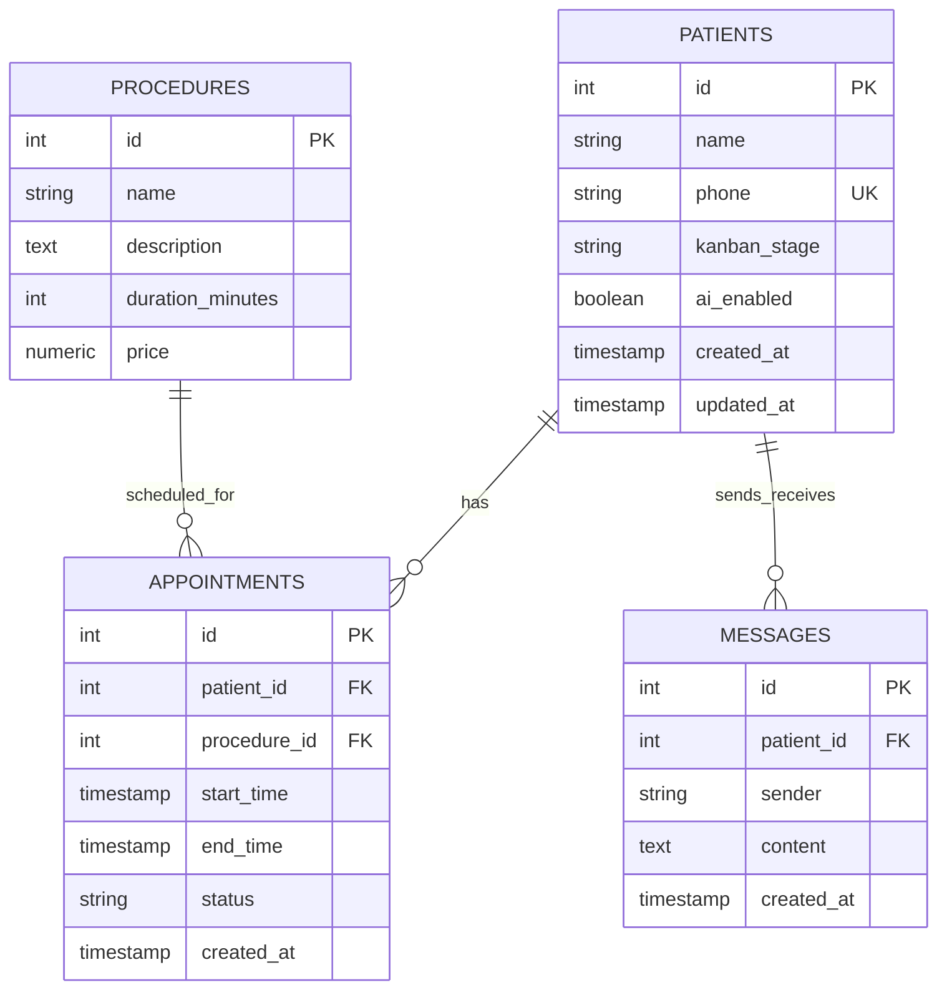

# Data Model: Unic Clinic Database Schema

This document details the PostgreSQL schema designed for the Unic Clinic system. The database handles lead capture, message logs, procedures, and appointments.

## Entity Relationship Diagram (Conceptual)

## Table Specifications

### 1. `patients` (Leads)
Stores contact information for patients interacting with the clinic.

| Column | Type | Constraints | Description |
|--------|------|-------------|-------------|
| `id` | SERIAL | PRIMARY KEY | Unique identifier. |
| `name` | VARCHAR(255) | NULL | Patient's name (extracted by AI or manual input). |
| `phone` | VARCHAR(50) | UNIQUE, NOT NULL | WhatsApp identifier/number (JID or clean digits). |
| `kanban_stage` | VARCHAR(50) | NOT NULL, DEFAULT 'novo_lead' | Stages: `novo_lead`, `qualificado`, `agendado`, `sem_interesse`. |
| `ai_enabled` | BOOLEAN | NOT NULL, DEFAULT TRUE | Handoff flag. If `FALSE`, AI ignores incoming messages. |
| `created_at` | TIMESTAMP | DEFAULT CURRENT_TIMESTAMP | Date lead was first captured. |
| `updated_at` | TIMESTAMP | DEFAULT CURRENT_TIMESTAMP | Date lead was last updated. |

---

### 2. `procedures`
Pre-seeded catalog of treatments and aesthetics procedures offered by Unic Clinic.

| Column | Type | Constraints | Description |
|--------|------|-------------|-------------|
| `id` | SERIAL | PRIMARY KEY | Unique identifier. |
| `name` | VARCHAR(255) | NOT NULL | Name of the aesthetic procedure. |
| `description` | TEXT | NULL | Brief info for AI context. |
| `duration_minutes` | INTEGER | NOT NULL, DEFAULT 30 | Time slot block duration. |
| `price` | NUMERIC(10,2) | NOT NULL | Price in local currency. |

---

### 3. `appointments`
Tracks scheduling bookings.

| Column | Type | Constraints | Description |
|--------|------|-------------|-------------|
| `id` | SERIAL | PRIMARY KEY | Unique identifier. |
| `patient_id` | INTEGER | FK (patients.id), NOT NULL | Link to patient. |
| `procedure_id` | INTEGER | FK (procedures.id), NOT NULL | Link to aesthetic procedure. |
| `start_time` | TIMESTAMP | NOT NULL | Appointment starting time. |
| `end_time` | TIMESTAMP | NOT NULL | Appointment ending time. |
| `status` | VARCHAR(50) | NOT NULL, DEFAULT 'confirmed' | Status: `confirmed`, `canceled`. |
| `created_at` | TIMESTAMP | DEFAULT CURRENT_TIMESTAMP | Timestamp of creation. |

*Constraints:*
- `CHECK (end_time > start_time)`
- A unique index / constraint or transaction lock will ensure that there are no overlapping schedules for a given receptionist/room (or general clinic slot availability limits).

---

### 4. `messages`
Audit trail and context log for all incoming and outgoing text interactions.

| Column | Type | Constraints | Description |
|--------|------|-------------|-------------|
| `id` | SERIAL | PRIMARY KEY | Unique identifier. |
| `patient_id` | INTEGER | FK (patients.id), NOT NULL | Link to patient conversation. |
| `sender` | VARCHAR(50) | NOT NULL | Who sent the message: `patient`, `ai`, `agent`. |
| `content` | TEXT | NOT NULL | Message text body. |
| `created_at` | TIMESTAMP | DEFAULT CURRENT_TIMESTAMP | Timestamp when sent/received. |
