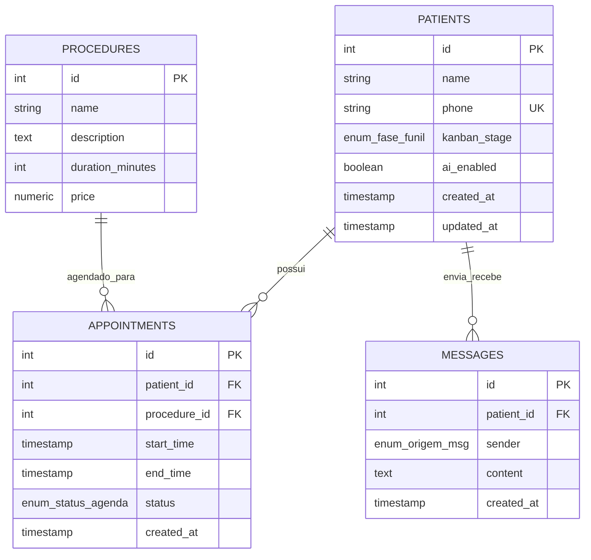

# Modelo de Dados: Esquema de Banco de Dados Unic Clinic

Este documento detalha o esquema do banco de dados PostgreSQL projetado para o sistema Unic Clinic. O banco gerencia a captação de leads, históricos de chat, procedimentos estéticos e a grade de agendamentos.

## Diagrama Entidade-Relacionamento (ER)

## Especificações das Tabelas e Enums

### Tipos Enums Customizados (PostgreSQL)

1. **`enum_fase_funil`:** `'lead_novo'`, `'qualificacao'`, `'agendamento_pendente'`, `'agendado'`, `'perdido'`, `'concluido'`.
2. **`enum_origem_msg`:** `'paciente'`, `'bot'`, `'recepcao'`.
3. **`enum_status_agenda`:** `'pendente'`, `'confirmado'`, `'cancelado'`, `'compareceu'`, `'no_show'`.
4. **`enum_tipo_midia`:** `'texto'`, `'audio'`, `'imagem'`, `'video'`, `'documento'`.

---

### 1. `patients` (Leads)
Armazena as informações dos pacientes/leads que interagem com a clínica.

| Coluna | Tipo | Restrições | Descrição |
|--------|------|------------|-----------|
| `id` | SERIAL | PRIMARY KEY | Identificador único do paciente. |
| `name` | VARCHAR(255) | NULL | Nome do paciente (extraído pela IA ou inserido manualmente). |
| `phone` | VARCHAR(50) | UNIQUE, NOT NULL | Número de WhatsApp / identificador JID. |
| `kanban_stage` | enum_fase_funil | NOT NULL, DEFAULT 'lead_novo' | Etapa ativa do lead no funil de vendas. |
| `ai_enabled` | BOOLEAN | NOT NULL, DEFAULT TRUE | Flag de Handoff. Se for `FALSE`, a IA ignora as mensagens de entrada. |
| `created_at` | TIMESTAMP | DEFAULT CURRENT_TIMESTAMP | Data de cadastro inicial do lead. |
| `updated_at` | TIMESTAMP | DEFAULT CURRENT_TIMESTAMP | Data da última atualização do registro. |

---

### 2. `procedures` (Procedimentos)
Catálogo pré-semeado de tratamentos e procedimentos estéticos oferecidos pela Unic Clinic.

| Coluna | Tipo | Restrições | Descrição |
|--------|------|------------|-----------|
| `id` | SERIAL | PRIMARY KEY | Identificador único do procedimento. |
| `name` | VARCHAR(255) | NOT NULL | Nome do procedimento (ex: Toxina Botulínica). |
| `description` | TEXT | NULL | Descrição do procedimento para contexto da IA. |
| `duration_minutes` | INTEGER | NOT NULL, DEFAULT 30 | Duração padrão do bloco de agendamento. |
| `price` | NUMERIC(10,2) | NOT NULL | Preço do procedimento. |

---

### 3. `appointments` (Agendamentos)
Rastreia as consultas reservadas na clínica.

| Coluna | Tipo | Restrições | Descrição |
|--------|------|------------|-----------|
| `id` | SERIAL | PRIMARY KEY | Identificador único da reserva. |
| `patient_id` | INTEGER | FK (patients.id), NOT NULL | Associação com o paciente. |
| `procedure_id` | INTEGER | FK (procedures.id), NOT NULL | Associação com o procedimento estético. |
| `start_time` | TIMESTAMP | NOT NULL | Horário de início do agendamento. |
| `end_time` | TIMESTAMP | NOT NULL | Horário de término do agendamento. |
| `status` | enum_status_agenda | NOT NULL, DEFAULT 'confirmado' | Estado do agendamento no funil. |
| `created_at` | TIMESTAMP | DEFAULT CURRENT_TIMESTAMP | Data de criação do agendamento. |

*Restrições (Constraints):*
- `CHECK (end_time > start_time)`
- Uma restrição transacional garante que não haja sobreposição de horários livres concorrentes.

---

### 4. `messages` (Mensagens)
Histórico completo de auditoria e contexto para todas as interações de chat.

| Coluna | Tipo | Restrições | Descrição |
|--------|------|------------|-----------|
| `id` | SERIAL | PRIMARY KEY | Identificador único da mensagem. |
| `patient_id` | INTEGER | FK (patients.id), NOT NULL | Associação com a conversa do paciente. |
| `sender` | enum_origem_msg | NOT NULL | Remetente da mensagem. |
| `content` | TEXT | NOT NULL | Corpo de texto da mensagem. |
| `created_at` | TIMESTAMP | DEFAULT CURRENT_TIMESTAMP | Data/hora em que a mensagem foi criada. |
